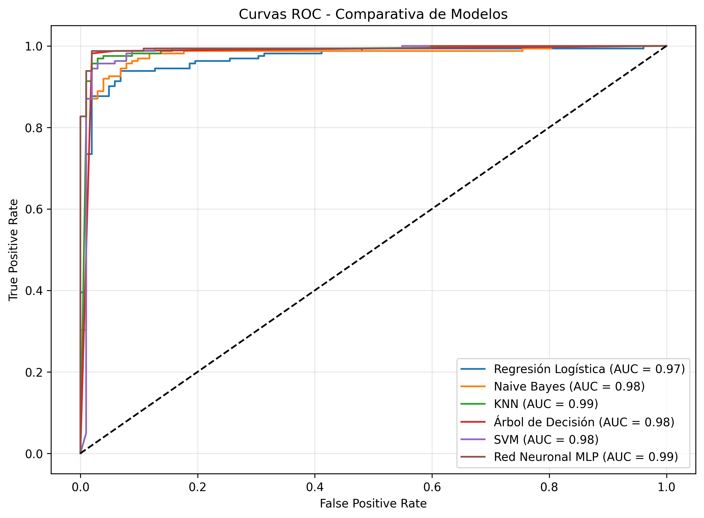
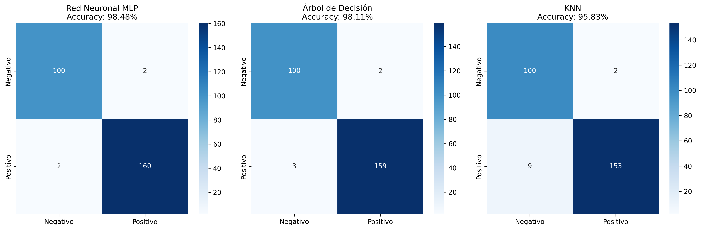
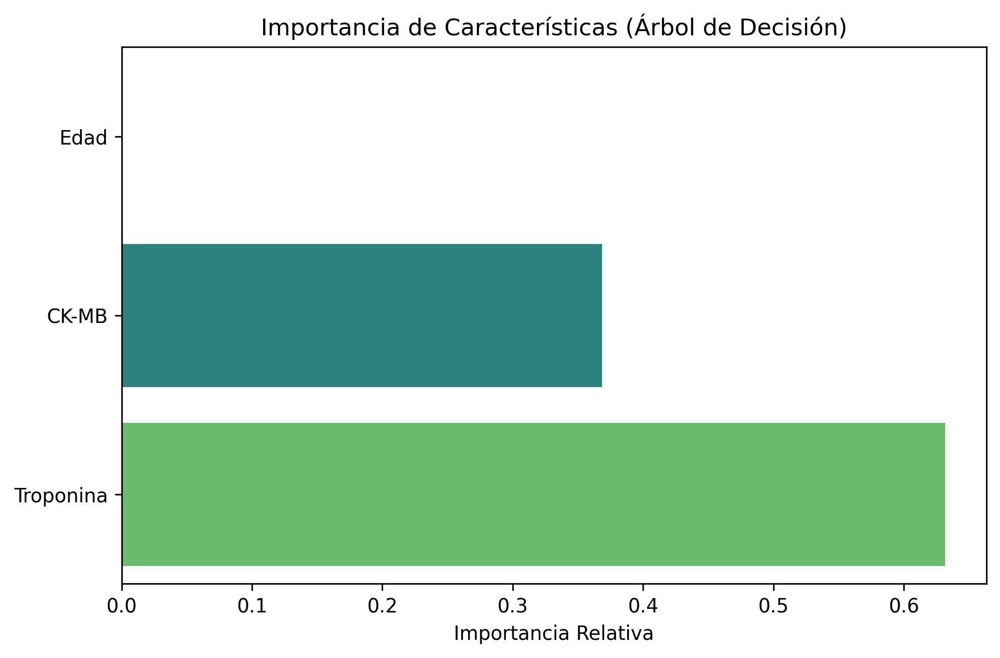

# Predicción de Riesgo de Ataque Cardíaco 🫀

Este proyecto utiliza técnicas de **Aprendizaje Automático (Machine Learning)** para predecir el riesgo de un ataque cardíaco en pacientes basándose en biomarcadores clínicos. La aplicación ha sido desarrollada con **Streamlit** para proporcionar una interfaz interactiva y fácil de usar para profesionales de la salud.

## 🚀 Características
- **Multimodelo**: Compara predicciones de 6 modelos diferentes (Regresión Logística, Naive Bayes, KNN, Árbol de Decisión, SVM y Redes Neuronales).
- **Visualización Interactiva**: Gráficos de probabilidad (Pie charts), curvas ROC y matrices de confusión.
- **Métricas de Evaluación**: Análisis detallado de Accuracy, Precision, Recall, F1-score, F0.5 y F2-score.
- **Análisis de Rendimiento**: Comparativa del tiempo de inferencia entre modelos.

## 🔬 Metodología y Justificación Científica

Para este proyecto (V2), se seleccionaron variables críticas basadas en su relevancia clínica:

1.  **Troponina**: El "estándar de oro" para el diagnóstico de infarto. Niveles elevados indican daño directo al miocardio.
2.  **CK-MB**: Creatina Quinasa-MB; enzima vital para detectar re-infartos y evaluar la extensión del daño cardiaco.
3.  **Edad**: Factor de riesgo cardiovascular no modificable fundamental.

### Preprocesamiento y Manejo de Outliers
*   **Transformación Logarítmica**: Las enzimas cardiacas operan en escalas logarítmicas en situaciones críticas. Aplicamos `log(x + 1e-10)` para normalizar la distribución y tratar los valores extremos (outliers) que son biológicamente reales pero estadísticamente disruptivos.
*   **Escalamiento Estándar**: Normalización final para garantizar la convergencia de los modelos de optimización.

---

## 📊 Visualización del Rendimiento

A continuación se presentan las métricas clave obtenidas durante la fase de validación de los modelos.


*Curvas ROC-AUC: Evaluación del equilibrio entre sensibilidad y especificidad.*


*Matrices de Confusión: Análisis de falsos positivos y falsos negativos.*


*Importancia de Variables: Contribución relativa de cada biomarcador al modelo final.*

---

## 🛠️ Estructura del Proyecto
```text
├── app/                # Código fuente de la aplicación Streamlit
│   └── main.py
├── datasets/           # Conjuntos de datos utilizados
├── models/             # Modelos entrenados (.pkl) y escaladores
├── notebooks/          # Jupyter Notebooks (EDA y Modelado)
├── assets/             # Gráficos estáticos para documentación
├── requirements.txt    # Dependencias del proyecto
└── README.md           # Documentación
```

## ⚙️ Instalación y Ejecución Local

1. **Clonar el repositorio**:
   ```bash
   git clone https://github.com/inter097/predict-heart
   cd predict-heart
   ```

2. **Instalar dependencias**:
   ```bash
   pip install -r requirements.txt
   ```

3. **Ejecutar la aplicación**:
   ```bash
   streamlit run app/main.py
   ```

---
*Desarrollado como proyecto de portafolio para el curso de Aprendizaje Automático.*
